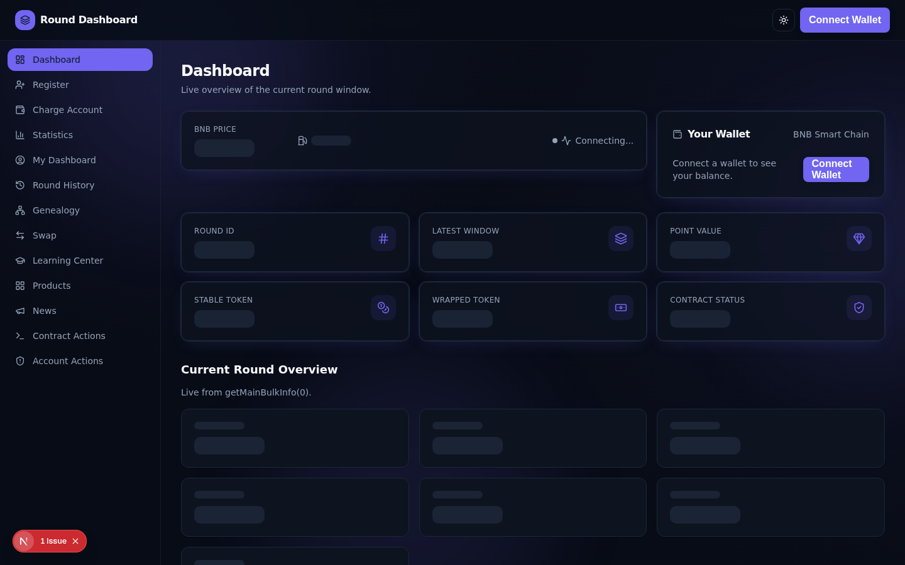
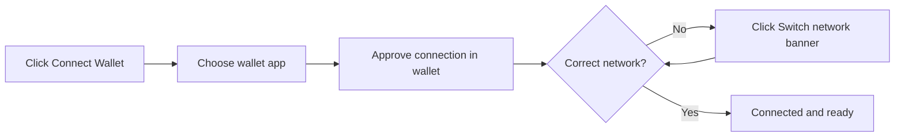
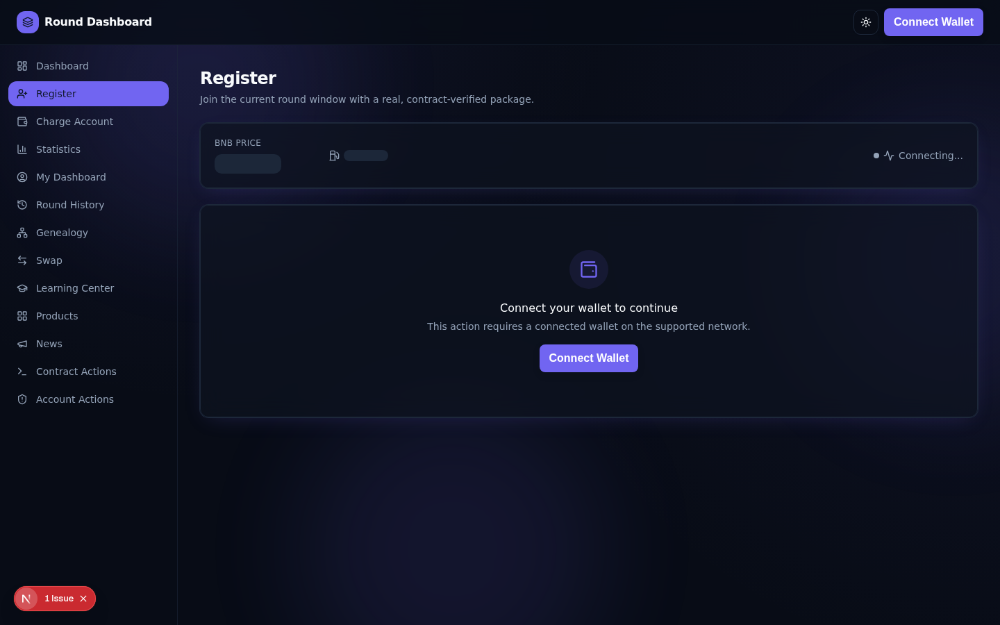
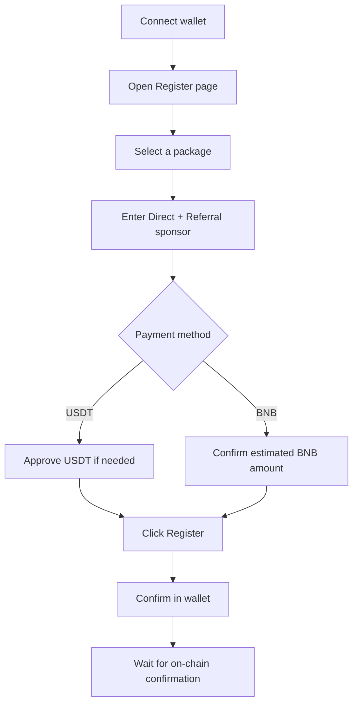
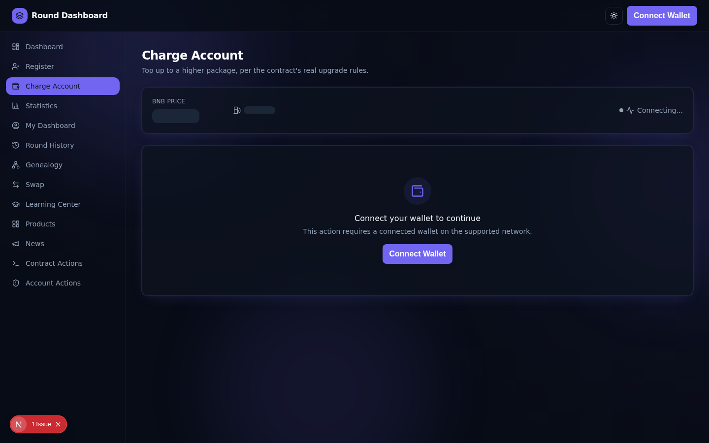
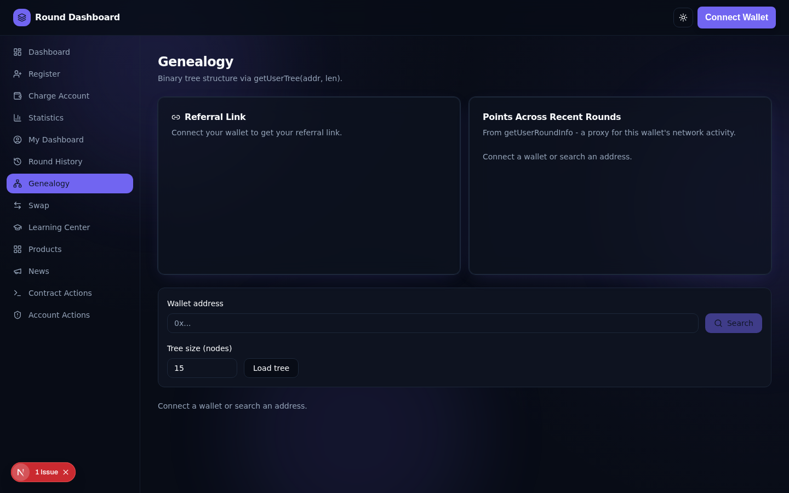
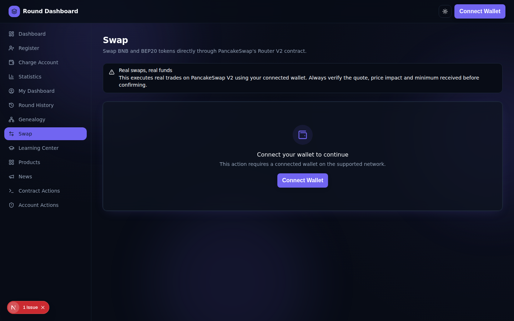
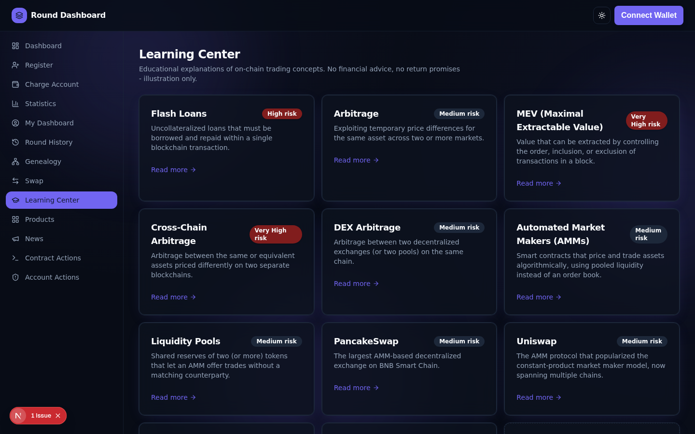
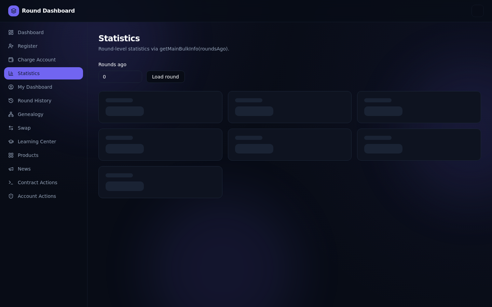
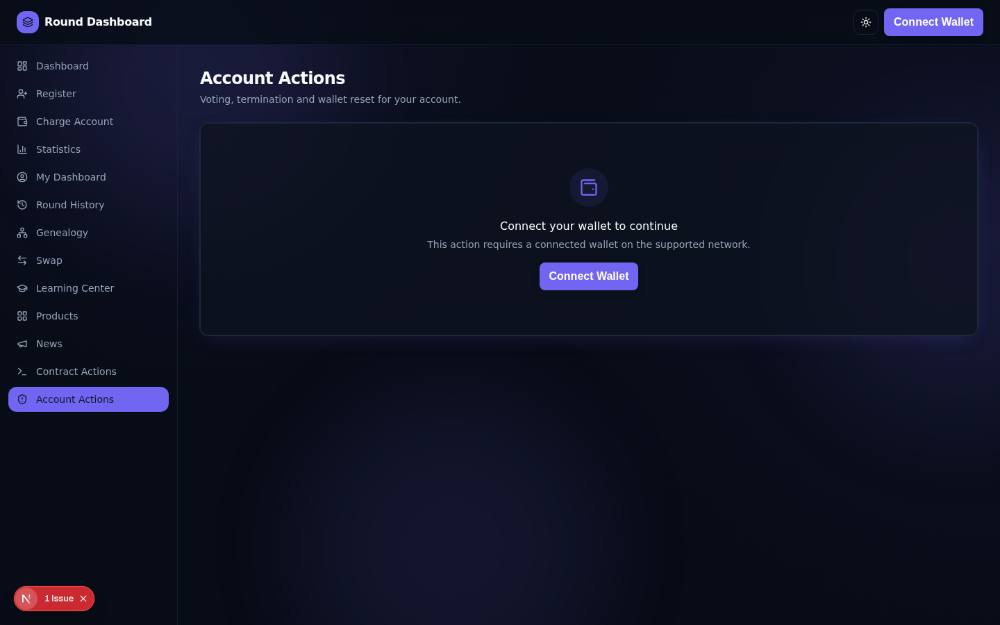

# Round Dashboard — User Guide

This guide explains how to use the Round Dashboard website. It only covers how the
platform works — it does not contain investment advice, return projections, or
recruitment material. Every screen and number described here comes directly from the
smart contract; nothing is simulated except where explicitly labeled "Educational
Demo" (the Learning Center simulator).

## Table of contents

1. [Wallet Connection](#1-wallet-connection)
2. [Dashboard](#2-dashboard)
3. [Registration](#3-registration)
4. [Deposit Guide (Registration & Top-Up)](#4-deposit-guide-registration--top-up)
5. [Withdrawal Guide](#5-withdrawal-guide)
6. [Profile (My Dashboard)](#6-profile-my-dashboard)
7. [Swap](#7-swap)
8. [Learning Center](#8-learning-center)
9. [Statistics](#9-statistics)
10. [Account Settings](#10-account-settings)
11. [Security](#11-security)
12. [FAQ](#12-faq)
13. [Troubleshooting](#13-troubleshooting)

---

## 1. Wallet Connection

There is no username/password login. Your crypto wallet **is** your login. Connecting
your wallet proves who you are and lets you sign transactions.

**Supported wallets:** MetaMask, Trust Wallet, and any wallet supporting WalletConnect.

**Steps:**

1. Click **Connect Wallet** in the top-right corner of any page.
2. Choose your wallet from the list (MetaMask, Trust Wallet, WalletConnect, etc.).
3. Approve the connection request inside your wallet app.
4. Make sure your wallet is switched to **BNB Smart Chain** — if it isn't, the site
   shows a **Switch network** banner; click it and confirm in your wallet.

Your wallet address is shown (shortened) in the top-right button once connected, with
a copy button and a link to view it on the block explorer wherever it appears in the app.

---

## 2. Dashboard

The Dashboard (`/`) is the home page and gives a live snapshot of the current round:

- **Native token price** (BNB), 24h change, gas price, and network/block status —
  refreshes automatically.
- **Your Wallet** — connected address and live balance.
- **Round ID, Latest Window, Point Value, Stable/Wrapped Token addresses, Contract
  Status** (open/closed) — read directly from the contract.
- **Current Round Overview** — users, round points, point value, round/total entered
  volume, and next binary pay timing, from the contract's `getMainBulkInfo`.
- **Network Growth** chart — users and volume across recent rounds.
- **Recent Activity** — transactions you've submitted from this browser (and, if the
  site operator has configured it, your full on-chain history with this contract).

---

## 3. Registration

Registration is required once per wallet before you can do anything else on-chain
(top-up, view your profile data, etc.).

**Steps:**

1. Connect your wallet (see [section 1](#1-wallet-connection)).
2. Go to **Register** in the sidebar.
3. Choose one of the three packages — **Starter**, **Professional**, or
   **Enterprise**. Each card shows its exact USDT cost and its on-chain earnable cap.
4. Enter a **Direct Sponsor** address (the wallet that referred you) and a
   **Referral Sponsor** address (use **Auto-fill best referral** if you don't know one).
5. Choose how to pay:
   - **Pay with USDT** — if this is your first time, click **Approve USDT** once (a
     one-time permission letting the contract collect the exact USDT price), then
     register.
   - **Pay with BNB** — the amount shown is an estimate; the contract converts just
     enough of it to the exact USDT price and automatically refunds the rest.
6. Click **Register**, confirm the transaction in your wallet, and wait for
   confirmation. A transaction status panel shows Pending → Success/Failed with a
   link to view it on the block explorer.

If your wallet is already registered, this page automatically shows a link to
**Charge Account** instead, since you can't register twice with the same wallet.

---

## 4. Deposit Guide (Registration & Top-Up)

"Depositing" on this platform means either **registering** (first time) or
**topping up** to a higher package (**Charge Account** page, for wallets already
registered).

- **Supported assets:** USDT (BEP-20, on BNB Smart Chain) or BNB.
- **Amounts are fixed per package**, not freely chosen: $11, $55, or $110 (exact
  USDT value), matching the package you select.
- **Confirmation:** once you submit, the page shows live status: *Awaiting
  signature → Pending → Success/Failed*, plus the transaction hash and an explorer
  link.
- **Top-Up rules:** you can only move to a package strictly higher than your current
  one. The $110 package is the only one that can be repeated ("renewed"), and only
  once your current earnable cap on that package has been reached — the Charge
  Account page automatically greys out any option that isn't currently valid and
  explains why.

**Common mistakes to avoid:**
- Sending USDT without approving first (the transaction will fail).
- Sending less BNB than required (the swap needs enough to cover the exact USDT
  price; sending too little will revert the transaction — you only pay gas, no funds
  are lost).
- Trying to top up to the same or a lower package than your current one.

---

## 5. Withdrawal Guide

**There is no manual "Withdraw" button on this platform.** This is intentional, not a
missing feature — please read this section carefully so you know what to expect:

- **Direct and binary earnings are paid automatically.** When the contract processes
  payouts, your share is sent directly to your registered wallet as a USDT transfer.
  You don't request or claim it yourself.
- **Your accumulated figures** (direct earned, binary earned, earnable) are visible
  any time on your [Profile page](#6-profile-my-dashboard) — they reflect amounts
  already paid to your wallet or currently available to be paid out under the
  contract's rules.
- **Terminating your account** (see [Account Settings](#10-account-settings)) pays
  out your insurance/assurance balance, if you're eligible, directly to your wallet
  at the moment you terminate.
- If you were expecting a "request withdrawal" form, it doesn't exist here — check
  your wallet's transaction history and the Profile page instead.

---

## 6. Profile (My Dashboard)

The **My Dashboard** page (`/user`) shows a wallet's on-chain round data.

- It shows your own connected wallet by default; use the search box to look up any
  other address.
- Cards shown: **Round Points, Total Enter, Worth, Users, Direct Earned, Binary
  Earned, Earnable, Insurance Status.**
- **Round History** (`/history`) shows the same wallet's points and income across
  recent rounds as charts.
- **Genealogy** (`/genealogy`) visualizes your referral tree, and gives you a
  shareable referral link with a QR code.

---

## 7. Swap

The **Swap** page (`/swap`) lets you trade BNB and BEP-20 tokens directly through
PancakeSwap's Router V2 contract. This is a real trading feature — every swap here
uses real funds, exactly like using PancakeSwap directly.

**Steps:**

1. Connect your wallet and make sure you're on BNB Smart Chain.
2. Choose the token you're swapping **from** and **to**.
3. Enter an amount — the page shows a live quote, price impact, and minimum received.
4. Adjust slippage tolerance if needed (the gear icon).
5. If swapping a token other than BNB, approve it once when prompted.
6. Click **Swap** and confirm in your wallet.

---

## 8. Learning Center

The **Learning Center** (`/learn`) is educational content only — it explains
blockchain concepts (flash loans, arbitrage, MEV, AMMs, liquidity pools, PancakeSwap,
Uniswap, smart contract risk, wallet security) with diagrams and FAQs. The
**Simulator** (`/learn/simulator`) is a fully manual calculator you control — it does
not use real funds and does not predict or promise any real-world outcome.

---

## 9. Statistics

The **Statistics** page (`/statistics`) lets you browse round-level data for any past
round using the "Rounds ago" field: total users, round points, point value, round and
total entered volume, and next binary pay timing.

---

## 10. Account Settings

The **Account Actions** page (`/account`) contains wallet-level actions. Each has a
confirmation dialog before it executes, since these change on-chain state:

- **Vote Shutdown** — casts your vote to shut down the current round. You can only
  vote once per round.
- **Reset Wallet Address** — moves your registered account to a different wallet
  address. Double-check the new address; this cannot be undone.
- **Terminate Account** — permanently closes your account in this round window and
  pays out your insurance balance (if eligible). This is irreversible.

There's also a low-level **Contract Actions** page (`/contract-actions`) that exposes
every write function directly (for advanced users), showing live parameters, gas
estimate, and transaction status for each call.

---

## 11. Security

- **Never type your seed phrase or private key into this website or anywhere else.**
  No legitimate feature on this site ever needs it. Wallet connections only ever ask
  your wallet extension/app to approve — the site never sees your private key.
- **Read every transaction before approving it in your wallet** — check the contract
  address, the function being called, and the amount.
- **Double-check addresses** before entering a sponsor address or a new wallet
  address for Reset Wallet — these actions can't be reversed.
- **Review token approvals periodically** (e.g. via your wallet or a revocation tool)
  and revoke any you no longer need.
- **Be alert to phishing** — always confirm you're on the correct domain before
  connecting your wallet or approving a transaction.

---

## 12. FAQ

**Do I need an account or password?**
No. Connecting your wallet is your login — there's no separate username/password.

**Which networks are supported?**
The contract lives on BNB Smart Chain. The wallet connector supports switching
networks, but all contract actions require BNB Smart Chain.

**Why can't I select a custom amount when registering?**
The contract only accepts three fixed packages (10/50/100, i.e. $11/$55/$110). Any
other amount is rejected on-chain.

**I sent BNB but got some of it back — is that a bug?**
No. Paying with BNB sends slightly more than needed as a buffer; the contract swaps
only the exact USDT amount required and automatically refunds the rest.

**Why is my Top-Up option greyed out?**
You can only top up to a strictly higher package than your current one (except a
$110 renewal, which has its own cap). The page shows the reason under any disabled
option.

**Where do I see my earnings?**
On the [Profile / My Dashboard page](#6-profile-my-dashboard) — Direct Earned, Binary
Earned, and Earnable are shown there and update as the contract processes payouts.

**How do I withdraw my earnings?**
You don't need to — see the [Withdrawal Guide](#5-withdrawal-guide). Earnings are
sent to your wallet automatically.

**Is the Swap page connected to real funds?**
Yes. Unlike the Learning Center, Swap executes real trades with real funds via
PancakeSwap.

**Is the Learning Center Simulator using real money?**
No. Every number there is a manual input you control; no wallet or transaction is
involved.

**Can I change my registered wallet address?**
Yes, via **Reset Wallet Address** on the Account Actions page. This is permanent
once confirmed.

**What happens if I terminate my account?**
It's permanent for this round window. Any eligible insurance/assurance balance is
paid out to your wallet at that moment.

**Why did my transaction revert?**
See [Troubleshooting](#13-troubleshooting) below for the most common on-chain error
messages and what they mean.

---

## 13. Troubleshooting

| Symptom | Likely cause | What to do |
| --- | --- | --- |
| "Connect Wallet" does nothing | Wallet extension not installed / blocked pop-up | Install MetaMask/Trust Wallet or allow the connection pop-up |
| "Switch network" banner won't go away | Wallet still on the wrong chain | Click the banner, approve the network switch in your wallet |
| Transaction stuck on "Awaiting signature" | Wallet pop-up hidden behind another window, or you dismissed it | Check your wallet extension/app for a pending request |
| `InvalidStartBox` error | Trying to register/top-up with a value other than the three valid packages | Only use the package cards shown on Register/Charge Account |
| `InsufficientPayment` error | Sent too little BNB, or USDT allowance too low | Increase the BNB amount, or approve a sufficient USDT allowance |
| `UserNotFound` error | Action requires a registered wallet, but this one isn't registered | Register first |
| `WindowClosed` error | This round window has already closed | Wait for the new round window, or check the Dashboard's "newer window" banner |
| `AlreadyVoted` error | You already voted to shut down this round | No action needed — one vote per round is allowed |
| Swap quote shows "No liquidity route" | The selected token pair has no direct pool | Choose a different token pair |
| Gas estimate fails silently | Wallet not connected, or invalid inputs | Fill in all required fields correctly, then try again |

If a problem persists, note the exact error message and the transaction hash (if
any) from the transaction status panel — this is the fastest way to get help.
